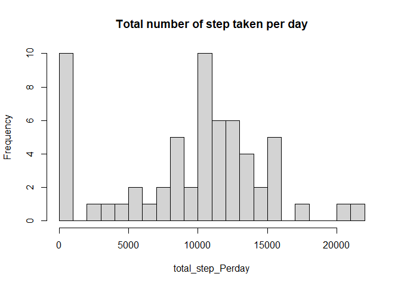
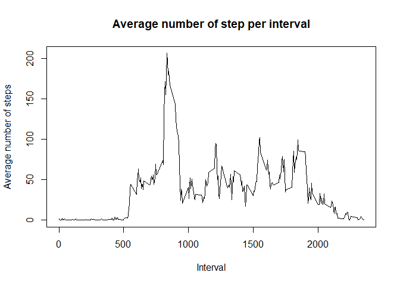
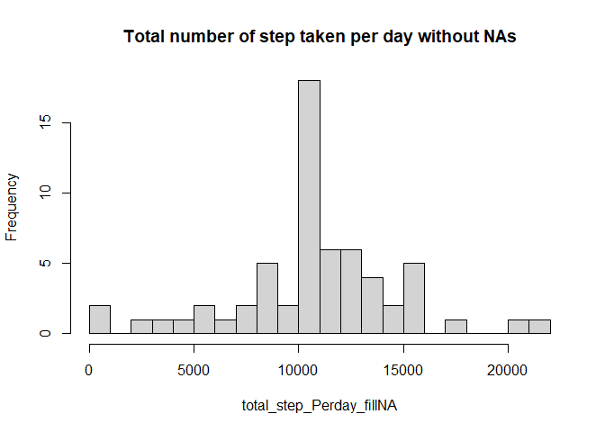
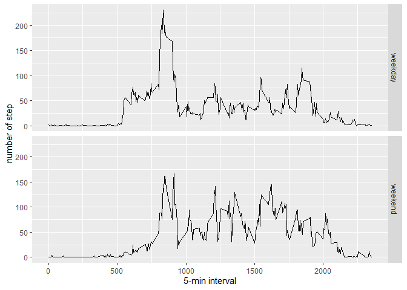

## Loading and preprocessing the data


```r
# Create a directory to contain the data
if(!file.exists("Data")){dir.create("Data")}
fileName <- "activity.csv"
unzip("./activity.zip",exdir = "./Data")
 
activity <- read.csv("./Data/activity.csv")

activity$date <- as.POSIXct(activity$date,format = "%Y-%m-%d")
activity$date <- as.factor(activity$date)
str(activity)
```

```
## 'data.frame':	17568 obs. of  3 variables:
##  $ steps   : int  NA NA NA NA NA NA NA NA NA NA ...
##  $ date    : Factor w/ 61 levels "2012-10-01","2012-10-02",..: 1 1 1 1 1 1 1 1 1 1 ...
##  $ interval: int  0 5 10 15 20 25 30 35 40 45 ...
```


## What is mean total number of steps taken per day?

```r
total_step_Perday <- with(activity,tapply(steps,date,FUN = sum,na.rm = TRUE))
hist(total_step_Perday,breaks = 25, main = "Total number of step taken per day")
```

<!-- -->

```r
mean(total_step_Perday)
```

```
## [1] 9354.23
```

```r
median(total_step_Perday)
```

```
## [1] 10395
```

## What is the average daily activity pattern?

```r
average_daily_activity <- with(activity,aggregate(steps,list(interval),FUN = mean,na.rm = TRUE))

names(average_daily_activity) <- c("interval", "mean")

plot(average_daily_activity$interval,average_daily_activity$mean,type = "l", ylab = "Average number of steps", main = "Average number of step per interval" ,xlab = "Interval")
```

<!-- -->

```r
average_daily_activity[which.max(average_daily_activity$mean),]
```

```
##     interval     mean
## 104      835 206.1698
```
## Imputing missing values

```r
sum(is.na(activity$steps) == TRUE)
```

```
## [1] 2304
```

```r
merged <- merge(activity,average_daily_activity)
merged$steps <- ifelse(is.na(merged$steps),merged$mean,merged$steps)

activity <- merged[-c(4)]
test<- merged[-c(4)]
rm(merged)

total_step_Perday_fillNA <- with(activity,tapply(steps,date,FUN = sum))
hist(total_step_Perday_fillNA,breaks = 25, main = "Total number of step taken per day without NAs")
```

<!-- -->

```r
mean(total_step_Perday_fillNA)
```

```
## [1] 10766.19
```

```r
median(total_step_Perday_fillNA)
```

```
## [1] 10766.19
```
There are a significant increase in the mean and median of the dataset since the missing values is being replace with the average step of it's interval, and the number of 0s has decreased beacause some 0s cause by all NA days has been removed. 

## Are there differences in activity patterns between weekdays and weekends?

```r
activity$day <- as.factor(ifelse(is.weekend(activity$date),"weekend","weekday"))

activity <- activity %>% group_by(day,interval) %>% summarise(meanInterDay = mean(steps))

ggplot(activity,aes(interval,meanInterDay)) + geom_line() + facet_grid(day~.) + ylab("number of step") + xlab("5-min interval")
```

<!-- -->
